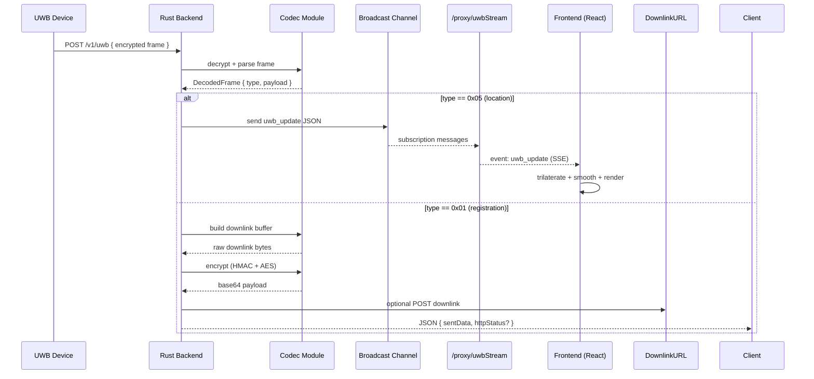
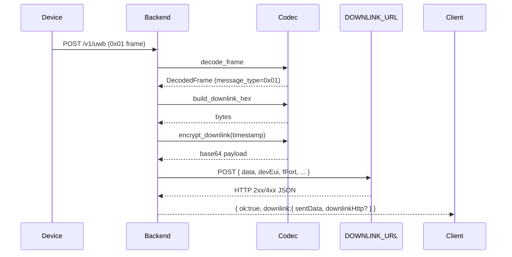

# Architecture & Design

This document provides the high-level (HLD) and low-level (LLD) design for the Pinpoint system.

## High-Level Design (HLD)

## Core Responsibilities

| Component | Responsibility |
|-----------|---------------|
| `main.rs` | Server bootstrap, CORS, mode selection (remote proxy vs. local ingestion) |
| `lorawan_stream.rs` | HTTP ingest (uplink) + SSE fan-out + optional downlink POST |
| `lorawan_codec.rs` | Crypto primitives (AES/HMAC), frame structural parsing, conversions |
| Frontend `App.jsx` | Stream consumption, trilateration, smoothing, plan + overlay rendering |
| `triangulation.js` | Algebraic solver converting anchor distances → (x,y) |
| `kalman.js` | Jitter reduction via minimal Kalman filter |

## Low-Level Design (LLD) Notes

### Broadcast Channel
`tokio::sync::broadcast` chosen for: multi-consumer fan-out, backpressure signaling (Lagged errors), and lock-free reads. Capacity 256 is sized for short bursts; adjust if devices emit higher frequency.

### Frame Parsing (0x05)
Currently converts only the first beacon record to `uwb_update`. Remaining beacons are preserved in `Remaining Beacon Info`; extending mapping requires parsing repeated 7-byte blocks.

### Trilateration
Uses algebraic solution subtracting first anchor equation from others (linear system). Shared anchor/tag Z cancels. For improved robustness (noisy >6 anchor scenarios) consider non-linear iterative optimization (Levenberg-Marquardt) with residual weighting.

### Calibration
Three-point affine solved via 3x3 determinants (Cramer's Rule). Points must be non-collinear; degeneracy detected by near-zero determinant. Persisted in localStorage as `w2n` and `n2w` coefficient arrays.

### Smoothing
EMA for simplicity & low CPU cost; Kalman alternative offers adaptive filtering where measurement variance differs. Expandable to velocity tracking (state vector [x,y,vx,vy]).

## Sequence: Registration Downlink

## Error Handling Strategy

- Decode failures: broadcast a `decode_error` JSON (non-fatal) so monitoring tools can track malformed frames.
- Downlink POST failures: captured inside response object (`downlinkHttpError` field) while still returning 200 to ingestion client (uplink already processed).
- Trilateration degenerate cases: ignored if <3 beacons; soft fallbacks for 1–2 beacons (anchor position or weighted midpoint).

## Security Considerations

- AES-ECB retained for device compatibility; lacks semantic security for repeated blocks. Future upgrade path: AES-GCM or ChaCha20-Poly1305.
- HMAC segment currently not validated (timestamp coupling pending); add recomputation & constant-time compare when full signing context available.
- CORS currently permissive (demo); lock down origins for production.

## Performance Targets

- End-to-end latency (uplink HTTP → frontend render) target < 250ms (excluding network RTT to Downlink URL).
- Frontend path DOM size capped by limiting segments to recent 120 per device, preventing layout thrash.
- Broadcast channel capacity sized to handle brief spikes without eviction; monitor Lagged occurrences.

## Future Enhancements

- Multi-beacon 0x05 mapping & multi-tag handling.
- Metrics endpoint (Prometheus scrape) for frame counts, decode errors, latency percentiles.
- WASM port of trilateration for heavier optimization / future 3D expansion.
- Signature verification + replay protection using timestamp windows.
