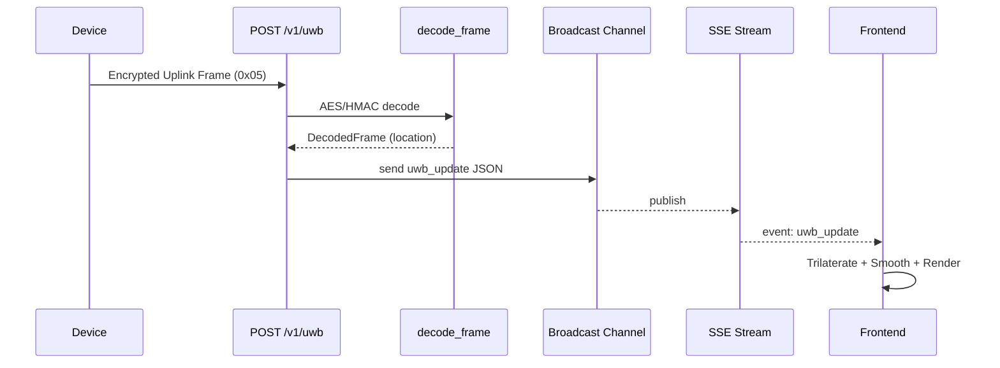
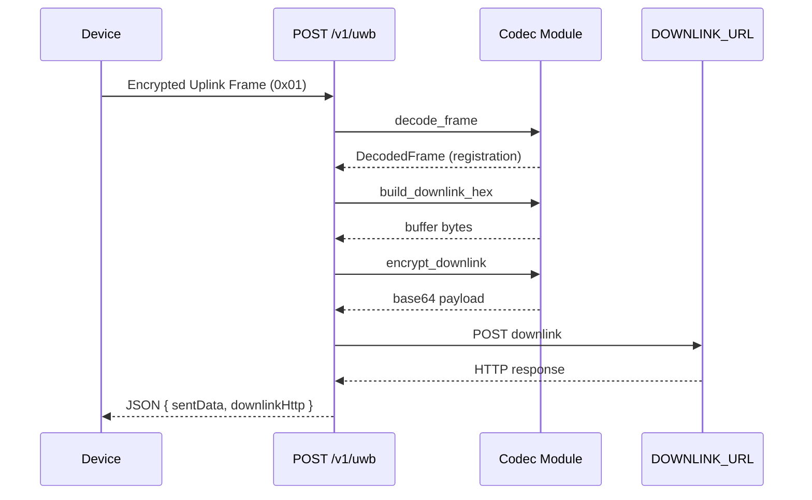
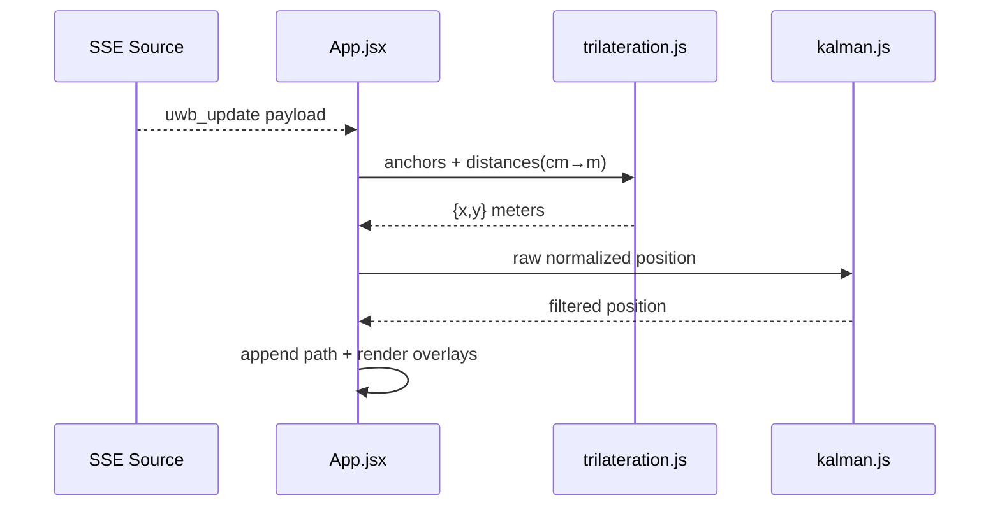

# Sequence Diagrams

Additional Mermaid diagrams focusing on specialized flows.

## Live Location Update

```mermaid
sequenceDiagram
  participant Dev as Device
  participant Ingest as POST /v1/uwb
  participant Codec as decode_frame
  participant Bcast as Broadcast Channel
  participant SSE as SSE Stream
  participant FE as Frontend
  Dev->>Ingest: Encrypted Uplink Frame (0x05)
  Ingest->>Codec: AES/HMAC decode
  Codec-->>Ingest: DecodedFrame (location)
  Ingest->>Bcast: send uwb_update JSON
  Bcast-->>SSE: publish
  SSE-->>FE: event: uwb_update
  FE->>FE: Trilaterate + Smooth + Render
```

## Registration + Downlink

```mermaid
sequenceDiagram
  participant Dev as Device
  participant Ingest as POST /v1/uwb
  participant Codec as Codec Module
  participant DL as DOWNLINK_URL
  Dev->>Ingest: Encrypted Uplink Frame (0x01)
  Ingest->>Codec: decode_frame
  Codec-->>Ingest: DecodedFrame (registration)
  Ingest->>Codec: build_downlink_hex
  Codec-->>Ingest: buffer bytes
  Ingest->>Codec: encrypt_downlink
  Codec-->>Ingest: base64 payload
  Ingest->>DL: POST downlink
  DL-->>Ingest: HTTP response
  Ingest-->>Dev: JSON { sentData, downlinkHttp }
```

## Trilateration Flow (Frontend)

```mermaid
sequenceDiagram
  participant SSE as SSE Source
  participant App as App.jsx
  participant Solver as trilateration.js
  participant Smoother as kalman.js
  SSE-->>App: uwb_update payload
  App->>Solver: anchors + distances(cm→m)
  Solver-->>App: {x,y} meters
  App->>Smoother: raw normalized position
  Smoother-->>App: filtered position
  App->>App: append path + render overlays
```
