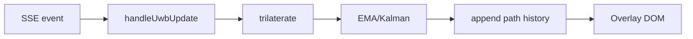

# Frontend (React / Vite)

Real-time visualization of UWB-derived positions over a factory plan.

## Core Files

- `App.jsx` – Streaming, trilateration, smoothing, rendering, calibration workflow.
- `triangulation.js` – Algebraic solver (shared-Z assumption).
- `kalman.js` – Minimal 2D stationary Kalman smoother.
- Components: anchors/device overlays, panels, mini-map.

## Data Flow

## Coordinate Systems

- Normalized (0..1) for storage and path history.
- World meters (factory dimensions) derived via calibration affine transforms or direct scaling.

## Calibration

Three user-selected points map normalized to world coordinates; affine solved via determinants; coefficients stored in `localStorage`.

## Smoothing Modes

- EMA: `new = α*current + (1-α)*prev`.
- Kalman: Independent scalar update per axis; process noise `q`, measurement noise `r` tunable.

## Rendering Strategy

- Inline SVG plan: Inject transient `<g>` with circles/text/lines (removal on each render) for performance.
- Raster image plan: Separate HTML overlays + dedicated `<svg>` path layer.
- Pixel-consistent sizing: convert desired CSS px → viewBox units using `unitsPerPx`.

## Testing

Vitest + React Testing Library verify trilateration edge cases, UI sizing, ignoring <3 beacon updates, and anchor interactions.

## Future Enhancements

- Multi-tag display / concurrent paths.
- Device trail thinning (Douglas-Peucker) for long sessions.
- WebGL canvas for large anchor/device counts.
